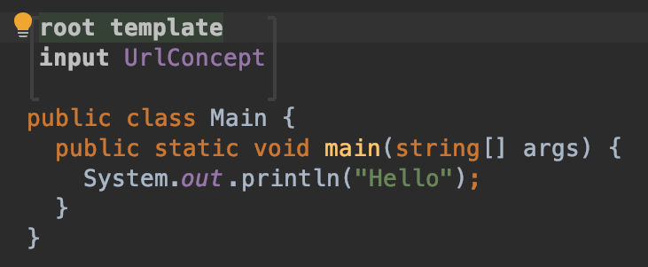
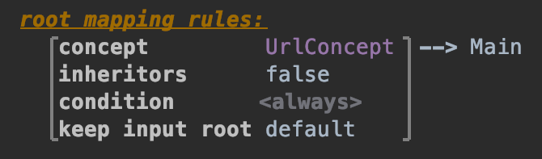
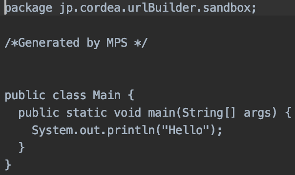

## Main class の作成

まず `Main` class の作成しましょう。

main@generator を右クリックし、'New' -> 'j.mps.baseLanguage' -> 'class' を選択します。すると Java なのかなんなのかよくわからない class が生成されます。
input には Concept を設定します。今回の場合は Root Concept である `UrlConcept` を設定します。

class 名は実のところなんでも良いのですが、`Main` にしておきましょう。
その次に `#main` を用意しますが、これは class 内で 'psvm' と入力すると勝手に作ってくれます。便利ですね。
まだ生成部分で用意すべきことが色々ありますが、ここで一度 `"Hello"` と `println` して動作を見てみましょう。

さて、これで実行すると print されるかというとそういうわけでもありません。もう一つ設定が必要です。

main@generator にある 'main' を見てください。これは generator の rule を設定する mapping configuration です。
先ほど作った `Main` を紐付けます。

`root mapping rules:` の空欄にフォーカスを当て、Enter を押すと rule の雛形が作られます。applicable concept は `UrlConept`、template は `Main` です。
これで Make して sandbox に先ほど作った Node を右クリックしてみてください。'Run Node null' (null の場合はなにか入力していれば変わっているはずです) と表示されるはずです。
実行してみましょう。

Hello と表示されましたか？

どのような Java code が生成されたか見てみましょう。Node を右クリックして 'Preview Generated Text' を選択します。
すると、先ほど書いた `Main` class に package が付加された実行可能な Java code が表示されます。

次は URL の生成部分を書いていきます。

