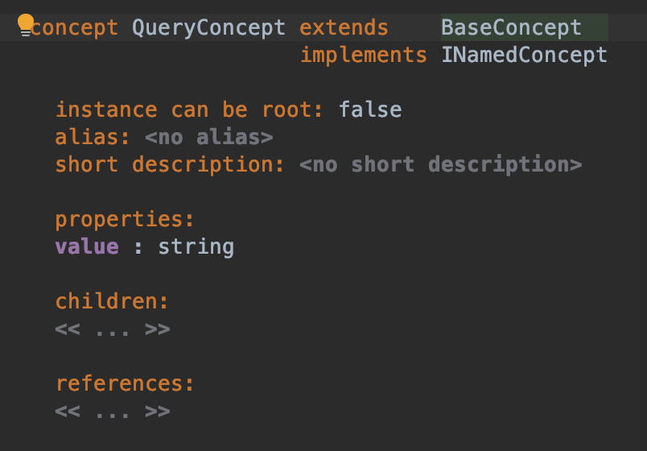
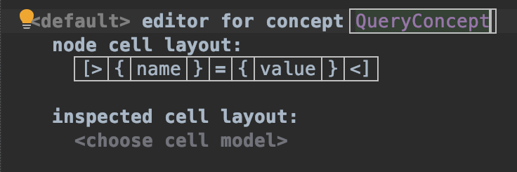

## Query の設計

まずは Query 部分を設計しましょう。

structure 部分を右クリックし、'Concept' を選択します。
名前は `QueryConcept` としましょう。

`INamedConcept` を実装してください、これは見ると分かりますが property として `name : string` を定義します。
Query は `value = a` のように `name` と `value` が必要になりますので、
加えて `value : string` を properties に定義しましょう。

Positive
:MPS を使う上では補完を最大限活用するようにするとスムーズです。  この先、MPS の定義を書く部分がいくつかありますが、最初から Hint に頼るか、最初の数文字を打って補完に頼るようにしましょう。同じ文字を打っても同じ挙動にはなりません (大抵はエラーになります)。始まりの文字だけ打って Enter を押せば補完が効きます。また、Intentions (Alt+Enter) も役に立つでしょう。  定義と同じく、Java のコードもあまり書かないほうが良いでしょう。基本的なコードは直接書いても認識されますが、MPS の内部では Java のコードも含めて XML で表現されます (generator.mps を見てください)。そのため、正しいコードを書いても IDE に認識されない限りは機能しません。

次は editor に移ります。
editor 部分を右クリックし、'Concept Editor' を選択します。
concept 名は先ほどの `QueryConcept` を入れてください。

続いて、cell layout を定義します。
`[>` と入力すると自動的に Horizontal Collection が入力されます。
入力した後、下部に 'name Property' というボタンが表示されるはずです、これをクリックしましょう。
`{name}` が入力されたら、その状態で Enter を押します。

今回は `value = a` のような入力をさせたいので、間に `=` が必要です。`=` を入力しましょう。
入力して Enter を押すと 'value Property' というボタンが表示されますので、これをクリックします。

これで `QueryConcept` は終わりです。続いて Path segment 部分を設計しましょう。

