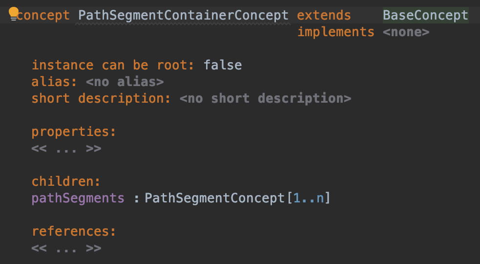
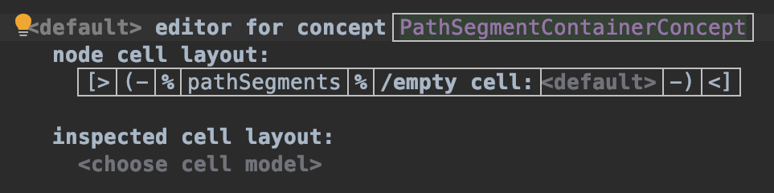
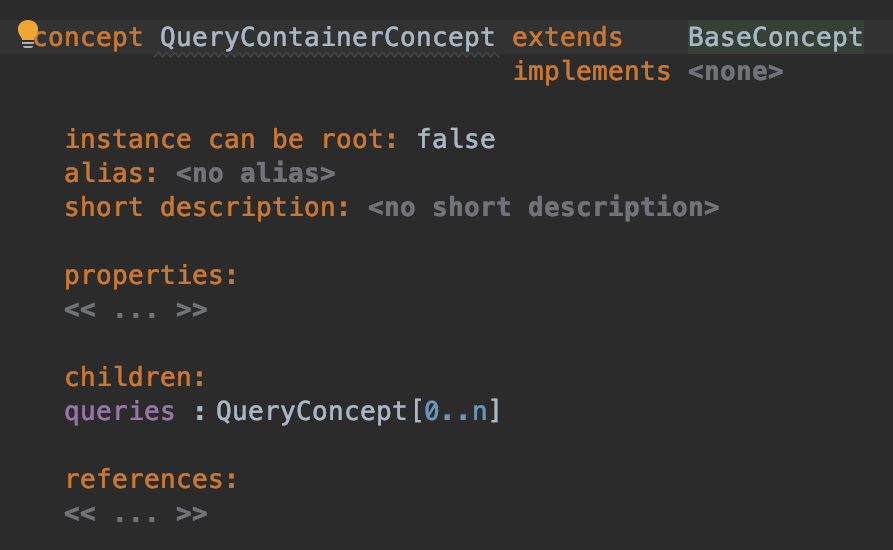
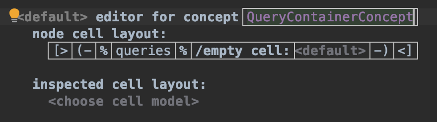

## Container の設計

ここでは、先ほど作った Path segment と Query を複数持つような structure の定義及び editor の設計をします。

まずは Path segment から設計します。
structure 部分を右クリックし、'Concept' を選択します。
名前は `PathSegmentContainerConcept` としましょう。

この Concept では子要素として `PathSegmentConcept` を複数持ちますので、children に `pathSegments : PathSegmentConcept[1..n]` というように書きます。
`1..n` とすることで、最低一つ以上 Path segment が入力されていないとエラーが出るようにできます。

続いて editor を作成します。
cell layout は先ほどまで見てきたものとは少し異なりますが、補完に頼ればほぼ困ることはありません。
Horizontal Collection を入力すると、'pathSegments Link' というボタンが表示されるはずですので、これをクリックします。
`pathSegments:`というのはただの文字列で今回は要らないので削ります。残しておいても構いません。

次に Query を見ていきます。
といっても、作りは `PathSegmentContainerConcept` と全く同じです。
children を `queries : QueryConcept[0..n]` とします。

editor は全く同じなので良き感じに作ってください。

以上で Path segment と Query 部分の設計が終わりました。
次はいよいよ structure / editor の最後、Url の設計に入ります。

