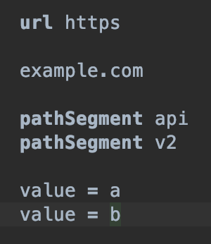

## Sandbox の作成

先ほどまで設計していた URL Builder の構文を一度確認してみましょう。

まずは 'Build' -> 'Make Project' (または Rebuild) を選択し Make した後、sandbox を右クリックし 'N' のマークがついた 'UrlConcept' をクリックします。

すると、未入力状態のエディタが開くはずです。
設計したとおり、url の後に scheme, pathSegment の後に `pathSegment ...` が入力できます。

ただ、これでは実際に Java code が生成される部分がなく、ただ構文を設計したに過ぎません。次からはいよいよその生成部分に移ります。

