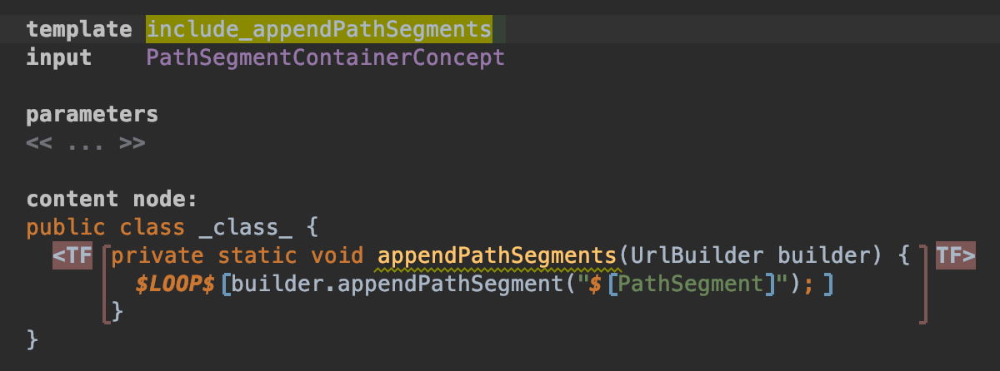

## appendPathSegments の template 定義

それではここからは template を定義していきます。

はじめのうちは何をしているか分からないかもしれませんが、この Chapter を乗り越えればどういうものかがなんとなく理解できると思います。

まずは appendPathSegments です。
`Main` class に `#appendPathSegments(UrlBuilder builder)` を定義し、それを main から呼び出します。
main で直接 `UrlBuilder#appendPathSegment` を呼び出しても良いのですが、今回は template の使い方を見るために多少冗長な書き方をしています。

それでは、main@generator を右クリックし、'template declaration' を選択します。
template 名は `include_appendPathSegments` としましょう。
input には対応する Concept を指定します。今回の場合は `PathSegmentContainerConcept` です。

Content node には実際の template を記述していきます。
Intentions (Alt + Enter) を表示し、'Replace with instance of ClassConcept concept' を選択します。
すると、空の Class が補完されるはずです。

実際に使用するのはこの class ではなく、中の method です。
そのため、この class 名はなんでも構いません。ここでは `_class_` とします。

`#appendPathSegments(UrlBuilder builder)` を定義します。
まずは

```java
private static void appendPathSegments(UrlBuilder builder) {

}
```

ここまでを普通に記述します。
実は書く順番がそれなりに大事なのでこのとおりに書いていって下さい。

`private` から `}` まで全体を選択し Intentions を表示して、'Create Template Fragment' を選択します。
これが後ほど `Main` class に差し込まれる部分になります。


次にその中に
```java
builder.appendPathSegment();
```

と記述します。
引数が足りないので赤くなっていると思いますが、そのままで大丈夫です。

書けたらこの `builder.appendPathSegment();` 全面を選択した状態で Intentions を表示します。
'Add LOOP macro over node.pathSegments' というのがあると思うので、これを選択します。
`builder...;` の部分が `$LOOP[...]` で囲われたと思います。

この LOOP Macro は `node.pathSegments` の要素分だけ内部の文を生成します。

次は引数をセットします。
引数は string ですので、`appendPathSegment()` に `("")` というように空文字を入力し、その状態で Intentions を表示します。

'Add Property Macro: node.pathSegment (property)' を選択します。`"$[]"` というような表示になったはずです。
この中は何を書いても値は変わらないので、わかりやすい名前をつけましょう。ここでは PathSegment とします。

ここでの Property Macro は LOOP Macro より渡された `PathSegmentConcept` から、 property として定義した `pathSegment` を string として受け取り、さらに `builder#appendPathSegment` に渡しています。

Positive
:Macro が何をしているかは Macro 部分にフォーカスを当て、Inspector (右下の Panel) を見れば分かります。



さて、今回も `Main` でやったのと同じ mapping が必要になります。
main を開いてください。

この include_appendPathSegments は reduction rules として定義します。
`recduction rules:` の部分で Enter を押し、Concept を `PathSegmentContainerConcept`、Consequence を `include_appendpathSegments とします。


これらを実際に `Main` class で生成する必要もあります。
`Main` class を開いてください。

生成されるのは static method ですから、class の直下に生成してほしいです。
main の下辺りを空けて Intentions を開きます。
'Apply COPY_SRC for node.pathSegmentContainer' を選択してください。


この COPY_SRC Macro は Node を Inspector の mapped node に書いた Node に置き換えます。今回の場合は `PathSegmentContainerConcept` です。
そして先ほどの reduction rule はこれらの Node を変換します。

では、実際に生成された Java code を見てみましょう。
Make (または Rebuild) し、sandbox で 'Preview Generated Code' を選択します。
何か Path segment を書いている場合は、以下のようになっているはずです。

```java
private static void appendPathSegments(UrlBuilder builder) {
    builder.appendPathSegment("api");
    builder.appendPathSegment("v2");
}
```


`appendPathSegments` の呼び出しは後で作りますので、この Chapter は以上です。
次はこれとは少し異なる方法で Query の構築を行いましょう。

