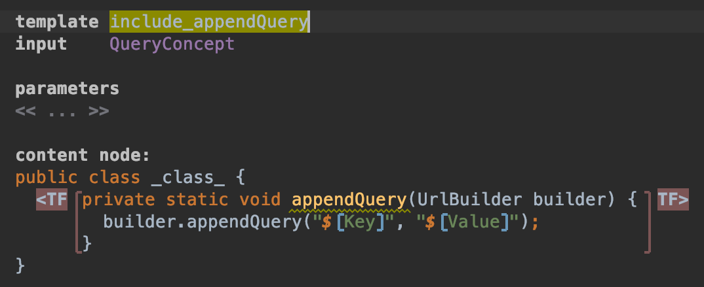
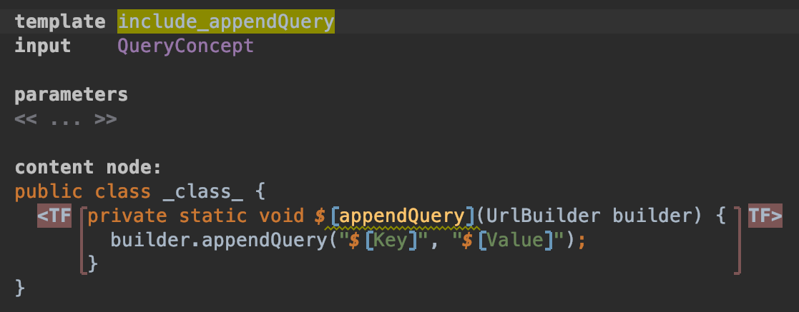
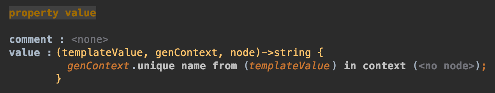
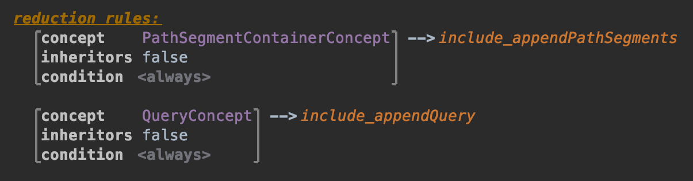
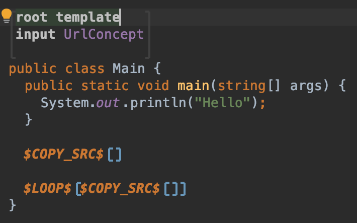
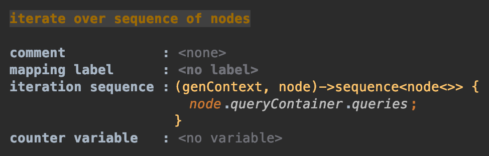
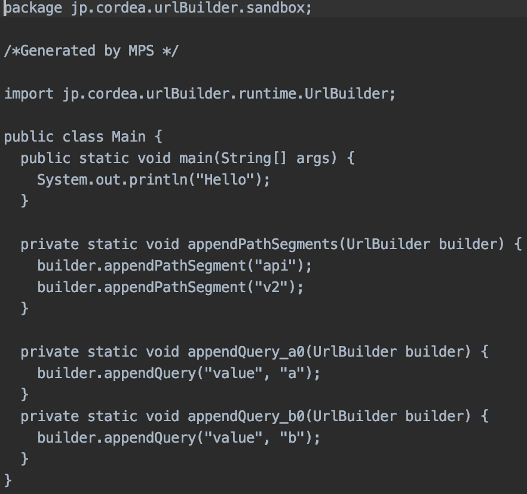

## appendQuery の template 作成

次は appendQuery です。
appendQuery は先ほどとは異なり、各 `builder#appendQuery` の呼び出しに対してそれぞれユニークな名前を持つ method を割り当てます。

同じように template を作成します。template 名は include_appendQuery とし、input は `QueryConcept` とします。
`QueryContainerConcept` ではないことに注意してください。

空の class を作成し、その中に `#appendQuery` を定義します。

```java
private static void appendQuery(UrlBuilder builder) {
}
```

続いてこれらを選択し、Template Fragment を作成します。

作成できたら `builder#appendQuery` を呼び出しましょう。

```java
... {
    builder.appendQuery();
}
```

続いて Property Macro を追加します。
第 1 引数に name property、第 2 引数に value property を割り当ててください。
名前は何でも良いですが、Key と Value にしましょう。



次に `appendQuery` の method 名をユニークにします。
`appendQuery` の部分にフォーカスを当て、Intentions を表示して 'Add Property Macro' を選択します。



`$[` の部分にフォーカスを当て、Inspector を確認してください。
value の中身がなにも入っていないはずです。

この `<no statements>` に `genContext.unique name from (templateValue) in context (<no node>)` というように書きます。
genContext を入力した後に 'un' くらいまで入力して Enter を押すと勝手に入力されます。



これでこの templateValue に従ってユニークな名前が自動的に生成されるようになります。

さて、これをまた reduction rule に追加します。
先ほど include_appendPathSegments を定義した下に書きましょう。
concept は `QueryConcept`、consequence は `include_appendQuery` とします。



次に `Main` class を開きます。
先ほど COPY_SRC Macro を定義した下に新たに COPY_SRC Macro を定義します。
今回は対象の Node は後で記述するので空の Macro を定義します。
Intentions から、'Add Node Macro' を選択し、中身に `COPY_SRC` と書きます。

続いて、これを LOOP Macro で囲みます。
COPY_SRC Macro を選択した状態で 'Add Node Macro' を選択肢、中身を `LOOP` とします。



Inspector を確認してください。
`iteration sequence` の中身がない状態になっているので、これを `node.queryContainer.queries` と指定し、`QueryConcept` の配列を返します。



そして COPY_SRC Macro の Inspector を確認し、`mapped node` で node を指定します (空の状態で Enter を押すと Function は生成されます)。

ここまでできたら生成される Code を確認してみましょう。
Make し、sandbox で 'Preview Generated Code' を選択します。
何か Query を書いている場合は、以下のようになっているはずです。

```java
private static void appendQuery_a0(UrlBuilder builder) {
    builder.appendQuery("value", "a");
}
private static void appendQuery_b0(UrlBuilder builder) {
    builder.appendQuery("value", "b");
}
```



それぞれユニークな名前が生成されていることが分かりますね。
次はこれらを呼び出す `#appendQueries` を定義します。

