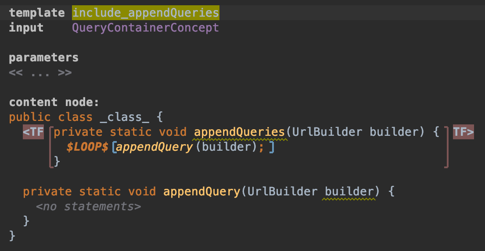
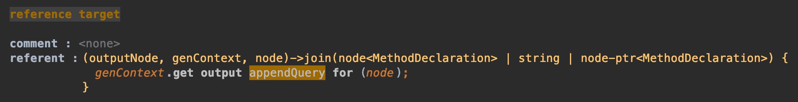

## appendQueries の template 作成

ここでは `#appendQueries` の template を作成します。
template 名を `include_appendQueries` とし、input は `QueryContainerConcept` とします。

`#appendQueries` と `#appendQuery` を定義します。

```java
private static void appendQueries(UrlBuilder builder) {
}

private static void appendQuery(UrlBuilder builder) {
}
```

`#appendQuery` は template として定義する際の method 呼び出しにおいてエラーを抑制するために定義しており、実際には無視されます。
`#appendQueries` の全体を選択して Template Fragment を作成します。

できたら `#appendQuery` を呼び出しましょう。

```java
... {
    appendQuery(builder);
}
```

次にこの `appendQuery(builder);` を LOOP Macro で囲います。'Add LOOP Macro over node.queries' を選択します。



さて、このままの状態で rule と `Main` class への追加を行うとエラーになります。この状態では `node.queries` の要素分だけ `#appendQuery` を呼び出すからです。
先に書いたとおり、`#appendQuery` は実際には生成されない method であり、前の Chapter で見た生成される method は `appendQuery_a0` のような名前でした。

ということは、何らかの方法で生成される method を呼び出す必要があります。こういう時に使えるのが label と Reference Macro です。

まず、main に移動し、`mapping labels:` に label を定義します。
名前を `appendQuery`、Output concept を `MethodDeclaration` とします。
Input concept は `<no input concept>` のままで大丈夫です。


次に `include_appendQuery` を選択し、Template Fragment の Inspector を確認してください。
`mapping label:` に `appendQuery` と記述します。


`include_appendQueries` に戻りましょう。
`#appendQuery` の呼び出し部分、`appendQuery` の名前の部分にフォーカスを当て、Intentions を表示します。
'Add Reference Macro' を選択してください。


`->$` の部分にフォーカスを当てて Inspector を確認すると、`referent :` という部分が確認できるはずです。
ここに、`genContext.get output appendQuery for (node);` というように記述します。
'genContext.get' まで入力して Enter を押し、'get output by label and input' を選択すると良いでしょう。



準備は完了したので、reduction rules に追加しましょう。
concept を `QueryContainerCocnept`、consequence を `include_appendQueries` として定義します。


最後におなじみの COPY_SRC Macro です。
`Main` class に移動し、class 配下の良さげなところで Intentions を表示し、'Apply COPY_SRC for node.queryContainer' を選択してください。


また生成結果を確認してみましょう。以下のような生成結果を確認できるはずです。

```java
private static void appendQueries(UrlBuilder builder) {
    appendQuery_a0(builder);
    appendQuery_b0(builder);
}
```


残りの Chapter も (設計としては) あと一つとなりました。
次は `#appendPathSegmnets` と `#appendQueries` を呼び出しを定義します。

