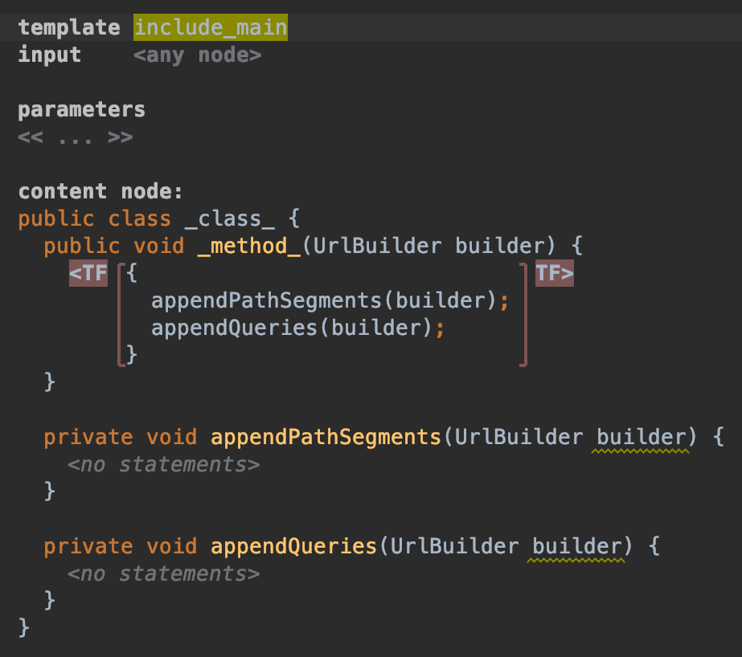
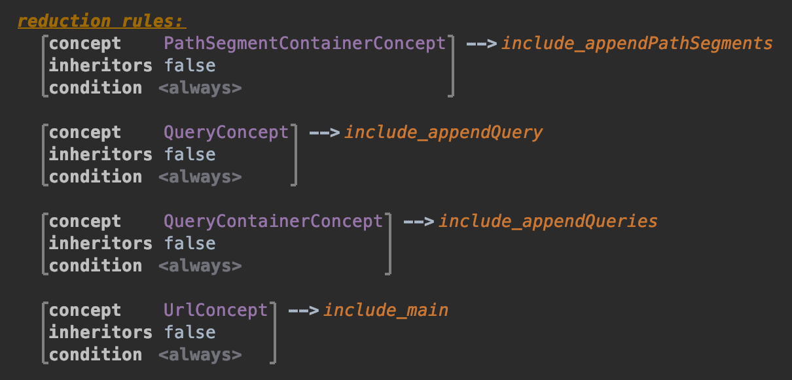

## main の template 作成

ここでは `#main` 内で `#appendPathSegments` と `#appendQueries` を呼び出すための template を作成します。
template 名を `include_main` とします。input は `<any node>` のままで大丈夫です。

空の class を `content node:` に定義し、`#appendPathSegments` と `#appendQueries` を定義します。

```java
private void appendPathSegments(UrlBuilder builder) {
}

private void appendQueries(UrlBuilder builder) {
}
```

これらは実際には無視されます。

今回は `#main` で呼び出すための template ですので、method 全体ではなく、中の呼び出しだけを Template Fragment とします。
そのため、class 名と同様に method 名もなんでも構いません (修飾子もなんでも良い)。

```java
public void _method_(UrlBuilder builder) {
}
```

さて、独立した 2 つの文を Template Fragment とすることはできないため、`{}` で囲います。

```java
public void _method_(UrlBuilder builder) {
    {
        appendPathSegments(builder);
        appendQueries(builder);
    }
}
```

`{` にフォーカスを当てて Template Fragment を作成します。

Positive
: ここでは予め定義していた `include_appendPathSegments` と `include_appendQueries` の method をそのまま空で定義し直すことで method の呼び出しを行っていますが、より安全に生成するなら Reference Macro を使用しましょう。<br>mapping labels に新しい label を追加し、呼び出しで Reference Macro を使用することで実現できます。



続けて main を選択し、reduction rules に追加しましょう。
Concept を `UrlConcept`、consequence を `include_main` として定義します。



以上でこの Chapter は終了です。
次で実際に URL を build します。

