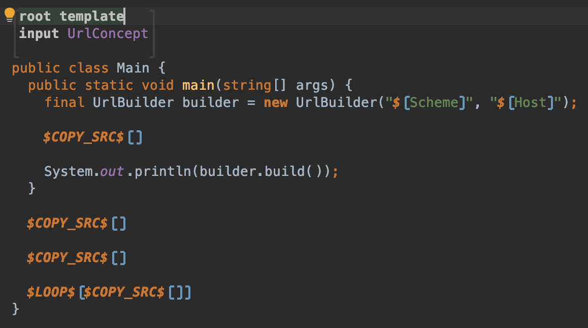
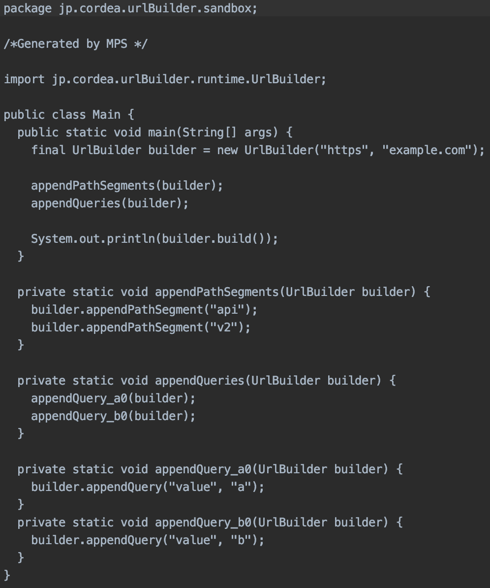

## Build した URL の出力

いよいよ最後です。
ここでは先程まで作っていた URL Builder、Template を使用して URL を出力します。

それでは `Main` class を選択してください。
まずは `#main` で print している "Hello" を `builder#build()` の結果に置き換えましょう。

```java
public static void main(string[] args) {
    final UrlBuilder builder = new UrlBuilder();
    System.out.println(builder.build());
}
```

Constructor に Scheme と Host を渡しましょう。
これはおなじみの Property Macro です。
Scheme には 'Add Property Macro: node.scheme (property)' を、
Host には 'Add Property Macro: node.name (property)' を選択します。

Path segment と Query の追加も必要になります。これは先程 template を作成しましたのでこれを使います。

'Add Node Macro' で COPY_SRC Macro を配置し、mapped node で `node` をそのまま返します。



これで生成された Code を確認してみましょう。

```java
public static void main(String[] args) {
    final UrlBuilder builder = new UrlBuilder("https", "example.com");

    appendPathSegments(builder);
    appendQueries(builder);

    System.out.println(builder.build());
}
```



生成された Code は問題なさそうです。
Node を右クリックして実行してみましょう。

```
https://example.com/api/v2?value=a&value=b
```

正常に出力されましたね。

以上でこの Codelab は終わりです。
なんとなく MPS の使い方が分かってもらえたなら幸いです。

なお、付録として typesystem による入力規則の設定を行います。興味があれば見てみてください。

